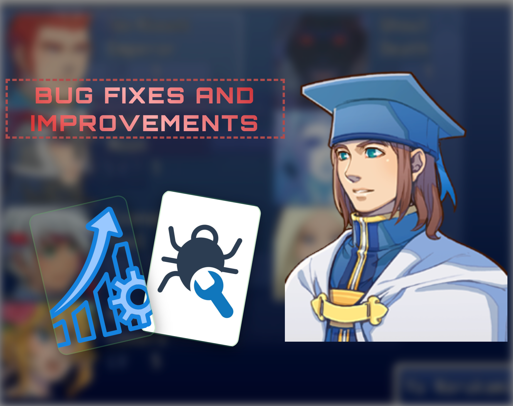
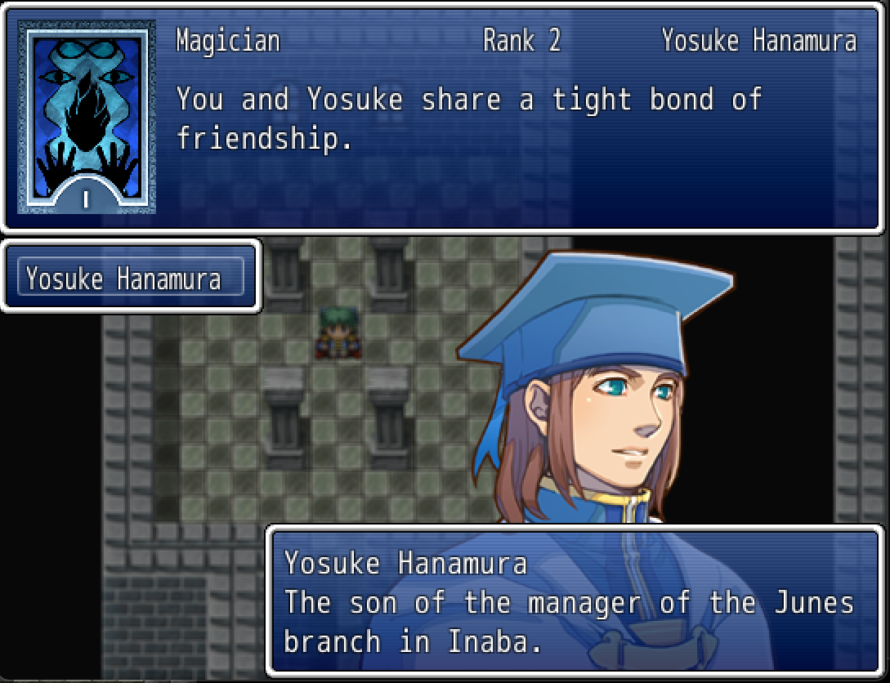
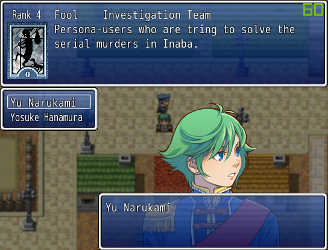
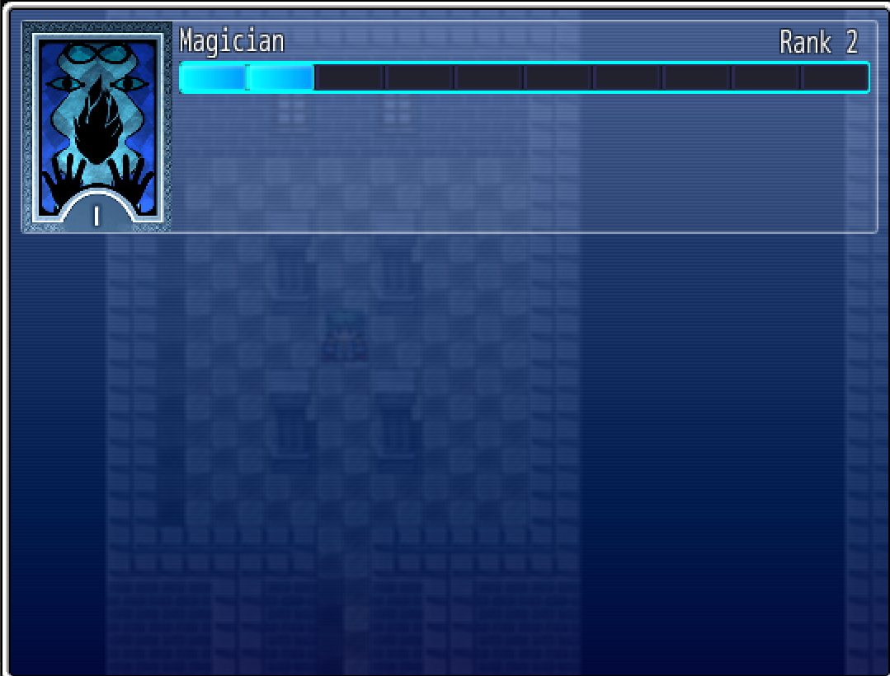
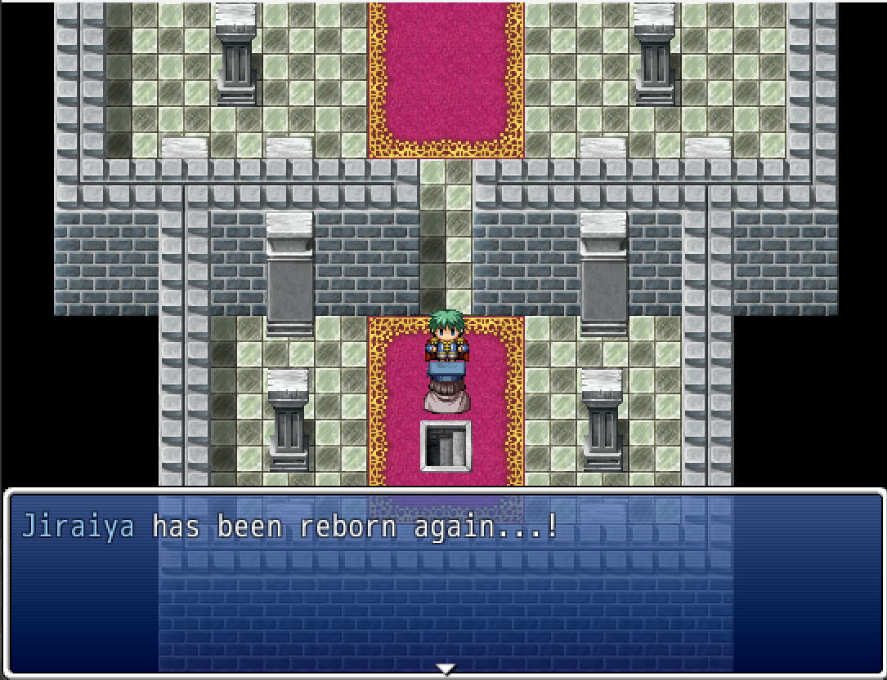
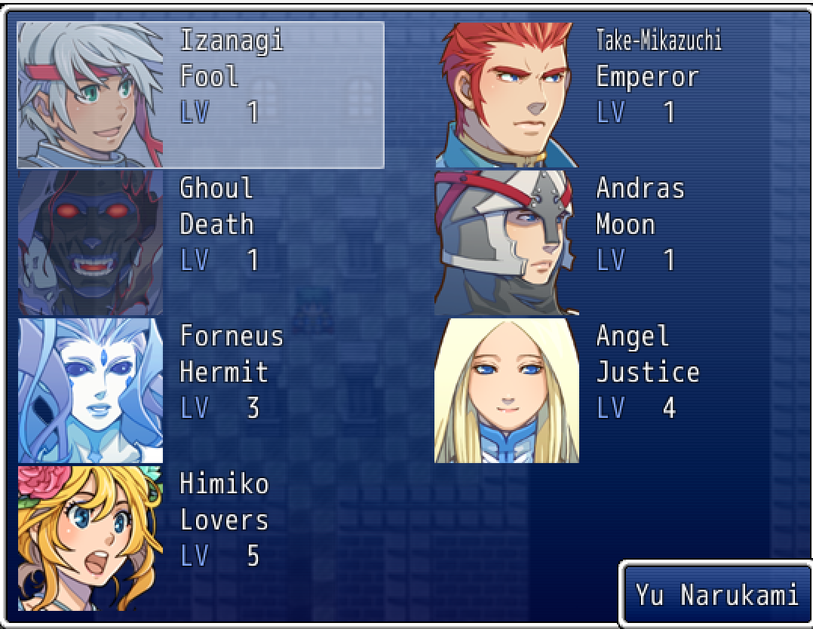

# Persona System

## 🎉 Latest Updates

### 🛠️ Bug Fixes, System Stability & Improvements

- **Shorter and fully playable demo**: Removed instructions from NPCs, as documentations is better written and available in [`Persona_System_Options.rb`](./Persona_System_Options.rb), and fixed event errors.
- **Resolved common events and arcana evolution issues** - Events now trigger properly during gameplay
- **Multiple scene-specific bug fixes** - Enhanced stability throughout the entire system
- **General code improvements**
- **Changed persona display during fusion** - Personas now show with actor icons and character information instead of text-only display ([example](#personas))
- **Smart auto-equip** - Automatically equips newly fused Personas when one of the parent Personas was previously equipped
- **Fixes**:
  - **Fusion result determination** - Fusion calculations now work correctly across all scenarios
  - **Special fusion result highlighting** - Special fusion results are now properly highlighted in the interface
  - **Stat, state and parameter rate calculation** - Those stats are now properly calculated when a persona is equpped
  - **Fusion result window handling** - Properly handle fusion result show, returning from canceling, asking for confirmation etc.
  - **Other**:
    - Fixed shuffle properly disposing background after showing result and during fadeout
    - Better transition into shuffle time

### ⚗️ Advanced Fusion System

- **Dynamic fusion results** 🔄 - Implemented original Persona fusion mechanics with automatic result determination. Read more [here](https://github.com/GCidd/RPGMakerVXAce_Scripts/blob/master/Persona_System/Persona_System_Options.rb#L479) or [here](https://www.thegamer.com/persona-5-royal-p5r-fusion-chart-cheapest-recipes-compendium).
- **CSV-based fusion configuration** 📊 - Define complex fusion conditions including parent arcanas, user level or item requirements, and custom formulas (same syntax way as skill formula)

### ⚙️ More Configuration Options

- **Audio customization** 🔊 - More sound configurations
- **Evolution system flexibility** - Set default common events for persona evolutions with actor-specific mapping for granular control
- **Dynamic fusion controls** 🎛️ - Toggle dynamic fusion results on/off (recommended for beginners due to setup complexity)
- **Custom fusion calculations** - Define your own fusion result level calculation functions
- **Fusion order** - Configure which fusion combinations are affected by parent order
- **Additional options** - Many more customization settings available in the [options file](./Persona_System_Options.rb)

---

## About the Persona System

This script brings the iconic Persona System from the Persona series (specifically Persona 4) to RPG Maker VX Ace. 

As described in the Megami Tensei Wiki:

> *A Persona is a manifestation of a Persona User's personality in the Persona series, referred to as a "mask" for an individual to use to face hardship.*

### Core Mechanics

**Persona Combat System**: Characters equip Personas that enhance all user parameters and provide unique skills. Following the original game's design, characters' abilities are entirely dependent on their equipped Persona. You can customize the parameter contribution balance between the user and their Persona.

**Skill Management**: Each Persona has a limited skill capacity. When learning new abilities, players can choose which existing skills to forget or skip the new skill entirely.

## Persona Acquisition Methods

### Fusion System ⚗️

Combine two (Normal Fusion) or three (Special Fusion) Personas to create new, more powerful ones. The system offers three distinct approaches for determining fusion results:

1. **Direct specification via RPG Maker notes** - Define parent requirements directly in the actor editor
2. **CSV-based configuration** - Set complex conditions including arcana rank, user level, required items, or custom formulas
3. **Dynamic determination** - Original Persona game mechanics that calculate results based on parent arcanas and levels, with configurable arcana combinations via CSV files

Fused Personas receive bonus experience based on Social Link ranks and the levels of the Personas used in fusion.

### Shuffle Time 🎲

Post-battle card selection mini-game triggered when enemies drop Persona cards.
Players navigate through:

- **Persona Cards**: Grant new Personas when selected
- **Blank Cards**: No effect but safe to choose  
- **Penalty Cards**: Remove all battle rewards (EXP and Gold)

Two gameplay modes available:

- **Rotating Cards**: Cards move horizontally, diagonally, or in combination patterns
- **Memory Match**: Match pairs within a limited number of attempts

## Social Links & Arcana System 🌟

Personas belong to different Arcanas, each representing a thematic category with its own progression system. As explained by the Megami Tensei Wiki:

> *Each Social Link represents a single Arcana, and raising a particular Social Link increases the experience bonus the protagonists receive when they fuse Personas of that Arcana. By completing a Social Link, it unlocks the ultimate Persona of that Arcana.*

**Arcana Evolution**: When an Arcana reaches specific rank milestones, Personas of that type can evolve into stronger forms. The Social Link menu displays all available Arcanas with their current ranks, constituent Social Links, and detailed descriptions.

## Screenshots & Videos

### Social Links

### Arcanas

#### Menu

#### Evolution

### Personas

### [Demo Videos](https://www.youtube.com/playlist?list=PLBpfffVr62KCmPbw9iQxcHB5Uq-gfOUnk)

## Installation & Configuration

**Setup**: Place the script above Main and below Materials in your project.

**Documentation**: Detailed instructions are included within the [Options script](./Persona_System_Options.rb), covering:

- Available configuration tags and their usage
- Scene and script call references
- Detailed system explanations
- Customizable option settings for each sub-system

## Credits

* **demifiend700** - [Original script requester](https://forums.rpgmakerweb.com/index.php?threads/persona-system-for-vx-ace-big-script-willing-to-trade.92260/)
* **Arthellinus** - [Game Mechanics/Persona Database](https://web.archive.org/web/20131219130533/http://www.gamefaqs.com/ps2/945498-shin-megami-tensei-persona-4/faqs/54981)
* **[Megami Tensei Wiki](https://megamitensei.fandom.com/wiki/Megami_Tensei_Wiki)** - Reference material and documentation

## Development Status

- [x] GitHub repository setup
- [x] Dynamic fusion result system matching original game mechanics
- [x] Comprehensive bug fixes and system improvements
- [ ] Post-battle Arcana effects implementation
- [ ] "Slot machine" Shuffle Time method